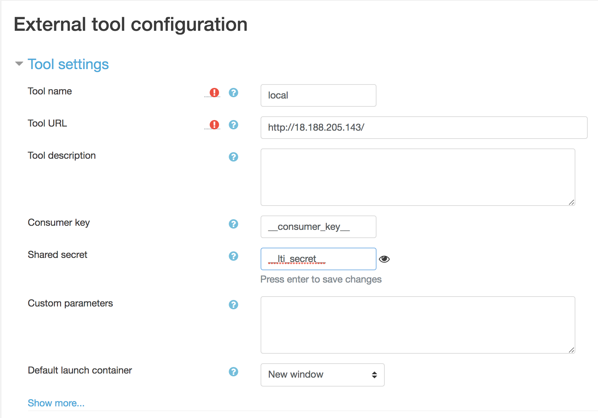
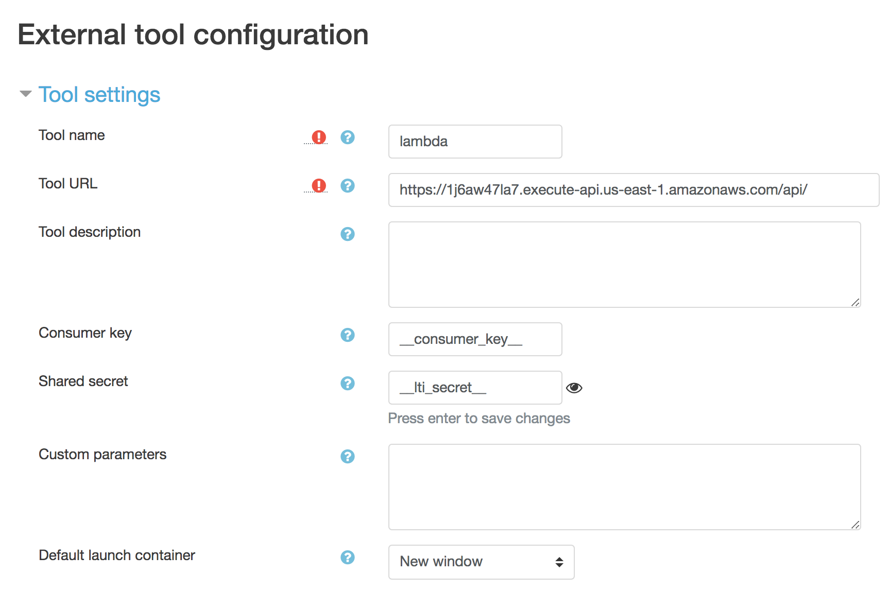

# Install on Amazon Linux 1

Start by installing Git and Chalice 

```
$ sudo yum install git
$ sudo pip install chalice
```

Clone the git repo as the pypi version does not include chalice support.

```
$ git clone https://github.com/brianjbeach/pylti 
```

Create a new project 

```
$ chalice new-project lti-chalice-sample && cd lti-chalice-sample
```

Add pylti and install it in the vendor folder

```
$ pip install pylti -t ./vendor/
```

Now, Overwrite pylti with my latest changes. 

```
$ cp -R ~/pylti/pylti ./vendor/ 
```

Open the autogenerated app.py and replace with the folowing.

```
from chalice import Chalice
from pylti.chalice import lti

app = Chalice(app_name='lti-chalice-sample')
app.debug = True 

@app.route('/', methods=['POST'], content_types=['application/x-www-form-urlencoded'])
@lti(request='initial', app=app)
def index(lti=lti):
    return {'hello': 'world'}
```

The last thing you need to do is add your key and secret. Secrets are stored 
as environment variables in Lambda. You can add an environment to 
.chalice/config.json. The key should be prefixed with CONSUMER_KEY_SECRET_. 
For example. 

```
{
  "stages": {
    "dev": {
      "api_gateway_stage": "api"
    }
  },
  "environment_variables": {
    "CONSUMER_KEY_SECRET___consumer_key__": "__lti_secret__"
  },
  "version": "2.0",
  "app_name": "lti-chalice-sample"
}
```

## Local Mode

Let's test in local mode. Use the command below where x.x.x.x is 
the private ip of the instance. sudo is need to use port 80.

```
$ sudo /usr/local/bin/chalice local --host x.x.x.x --port 80
```

I tested with Moodle configured like this.



## Deploy to Lambd

You can also deploy your function to lambda.

```
$ chalice deploy
```

This will return the **Rest API URL** which you will need to enter into your 
LMS. For example, it looks like this in Moodle.


